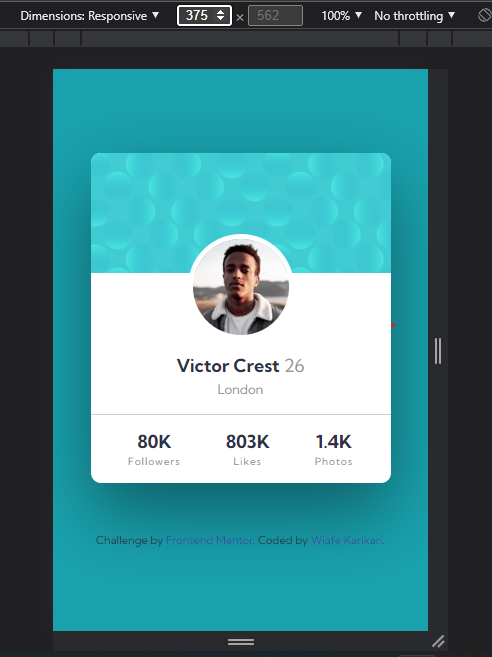
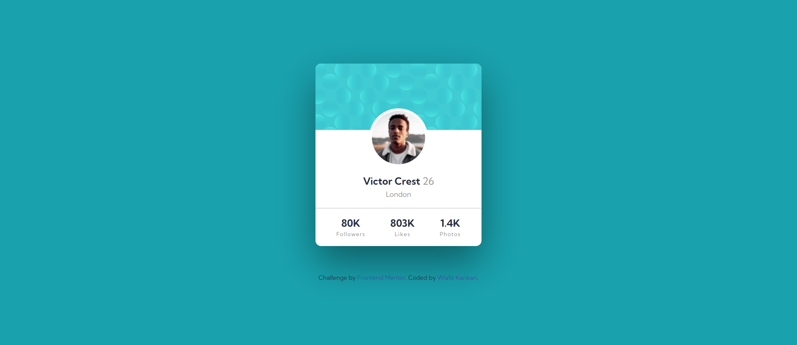

# Frontend Mentor - Profile card component solution

This is a solution to the [Profile card component challenge on Frontend Mentor](https://www.frontendmentor.io/challenges/profile-card-component-cfArpWshJ). Frontend Mentor challenges help you improve your coding skills by building realistic projects.

## Table of contents

- [Overview](#overview)
  - [The challenge](#the-challenge)
  - [Screenshot](#screenshot)
  - [Links](#links)
- [My process](#my-process)
  - [Built with](#built-with)
  - [What I learned](#what-i-learned)
  - [Useful resources](#useful-resources)
- [Author](#author)

## Overview

### The challenge

- Build out the project to the designs provided

### Screenshot

### Links

- Solution URL: [Add solution URL here](https://your-solution-url.com)
- Live Site URL: [Add live site URL here](https://your-live-site-url.com)

## My process

I started by rewritting the HTML, creatings the containers to hold each section of the card.
Then I start styling the mobile view first making sure it was responsive.
Finalised styles with the the desktop view using media queries.

### Built with

- Semantic HTML5 markup
- Flexbox
- Mobile-first workflow

### What I learned

- Learnt how to get rid of the whitespace left behind after using a relative positioning.

### Useful resources

- [stackoverflow](https://www.stackoverflow.com) - This helped me with getting rid of the whitespace left behind after a relative positioining of an element.

## Author

- Frontend Mentor - [@doubleKari](https://www.frontendmentor.io/profile/doubleKari)
- Twitter - [@stealyear](https://www.twitter.com/stealyear)
